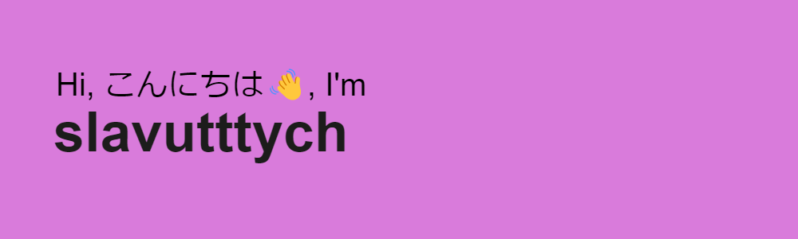

<h1 align="center"> A few words about me</h1>

<a>I'm current learning C# and Unity</a>

 
And i trying self in 3D Modeling

<a>I think, if you have a good idea or project, we can collaborate</a>

 
We can talk about our projects, ideas or just have a fun from something, lol

<a>With musical taste, everything is simple for me - EDM, breakcore, metal <s>and a tons of gachi covers</s></a>

 
"...Oh comon man, i just opened you, but you already eat my 8gb ram..."
  
<h1 align="center">My projects</h1>

  
###

 
<h1 align="center">My stats</h1>

###

 
<h1 align="center">My contacts</h1>

<pre>DISCORD - @slavutttych#4788
Telegram - @slavutttych
Twitter - @slavutttych
Youtube - https://youtube.com/@slavutttych
Mail - slavutttych@gmail.com</pre>

 
<h1 align="center">Just for fun</h1>

###

